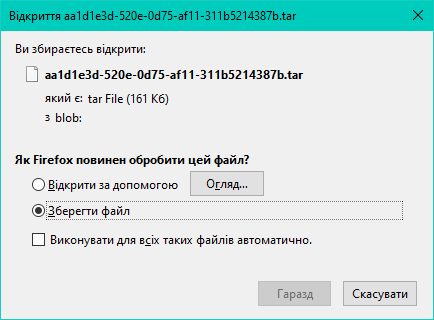

 **scaffold-p5-ccapture**
====================

Scaffold setup for capturing video of `p5.js` animation.

\
Used `CCapture.all.min.js` from [spite/ccapture.js](https://github.com/spite/ccapture.js/tree/master/build) repository, and `p5.js` from [p5.js official website](https://p5js.org/download/)

\
Set up
======

1. Clone this repo and navigate to project directory:

    ```
    git clone https://github.com/dkostmii/scaffold-p5-ccapture.git
    cd scaffold-p5-capture
    ```

2. Install **browser-sync**:
	- using `npm`:
      ```
      npm i -g browser-sync
      ```
	- using `yarn`:
      ```
      yarn global add browser-sync
      ```

3. [Download](https://ffmpeg.org/download.html) `ffmpeg` and add it to your `PATH`

4. If your are on Windows, downoad [7-Zip](https://www.7-zip.org/)

5. Write your sketch in `sketch.js`

6. Start **browser-sync**:
    ```
    browser-sync start --server -f -w
    ```

7. Download the **TAR** archive with images:

    

8. Unpack the TAR arhive

9. Proceed to directory with unpacked images and run this command:

    ```
    ffmpeg -r 30 -f image2 -s 1080x1080 -i "%07d.png" -vcodec libx264 -crf 17 -pix_fmt yuv420p output.mp4
    ```
    Resulting video will be written to `output.mp4` file.


> - - > - - > - - > - -
> - - > - - > - - > - -
> - - > - - > - - > - -
>
> ## **You have done that!**
> ### Enjoy ;)
>
